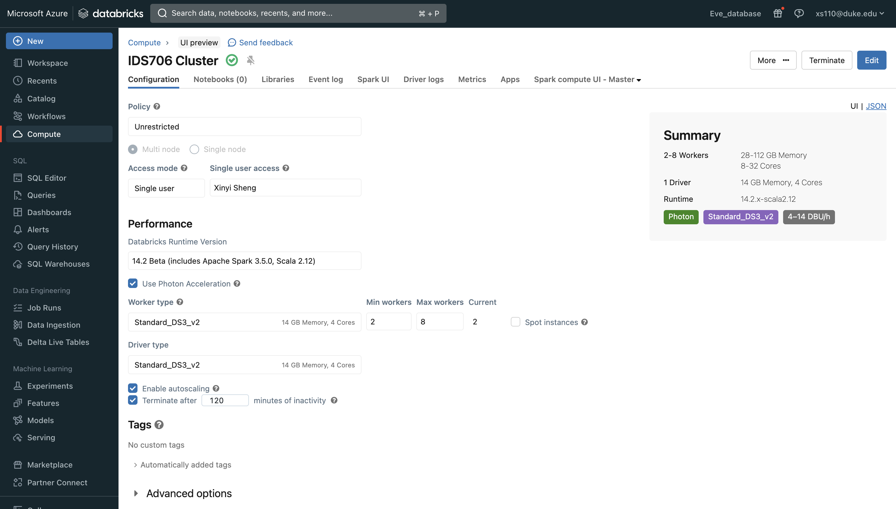
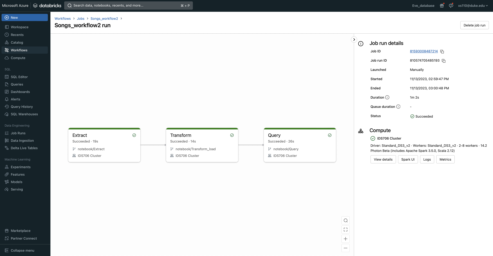
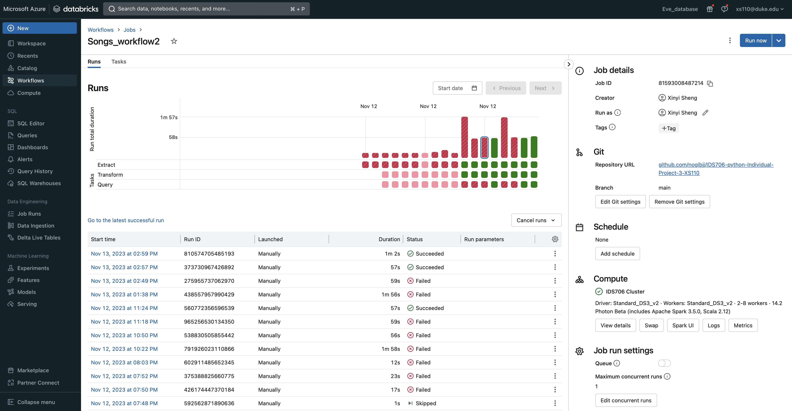
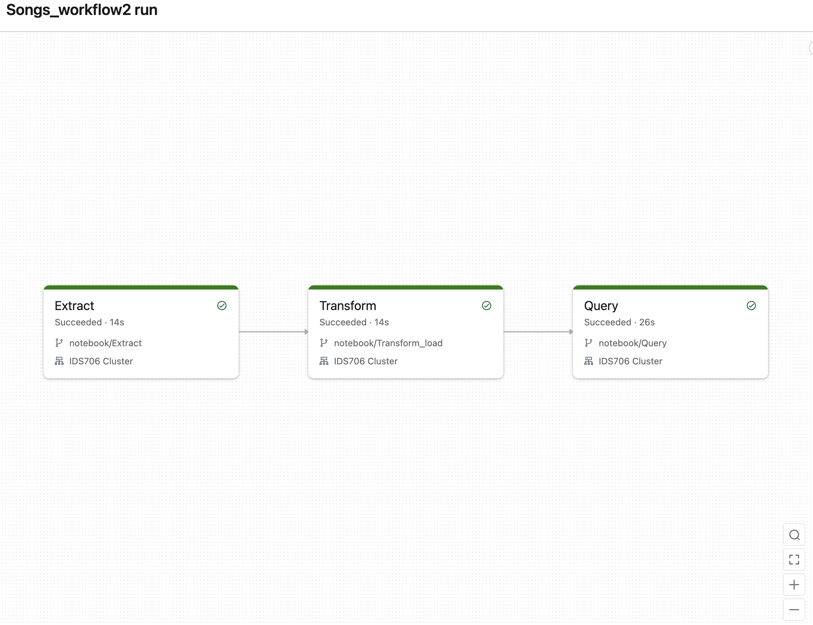
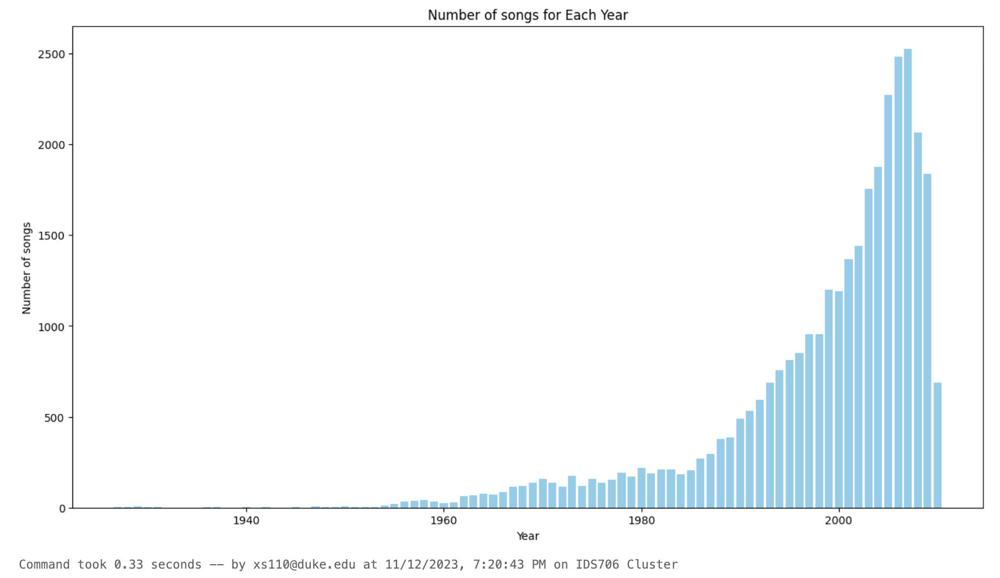
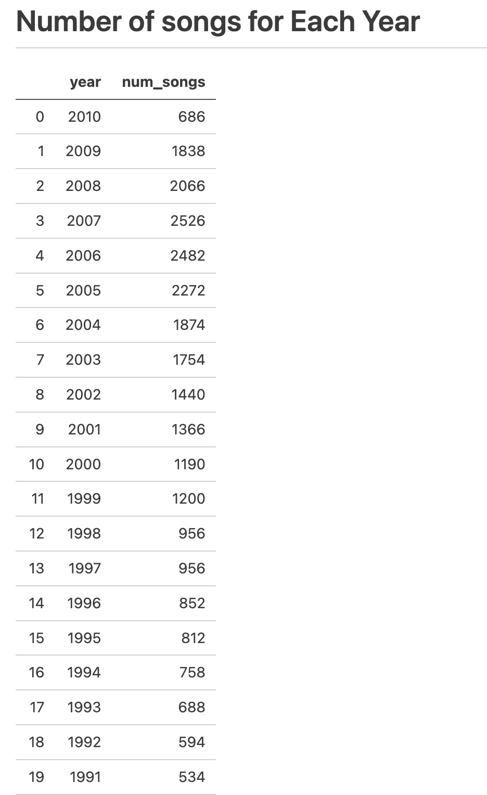
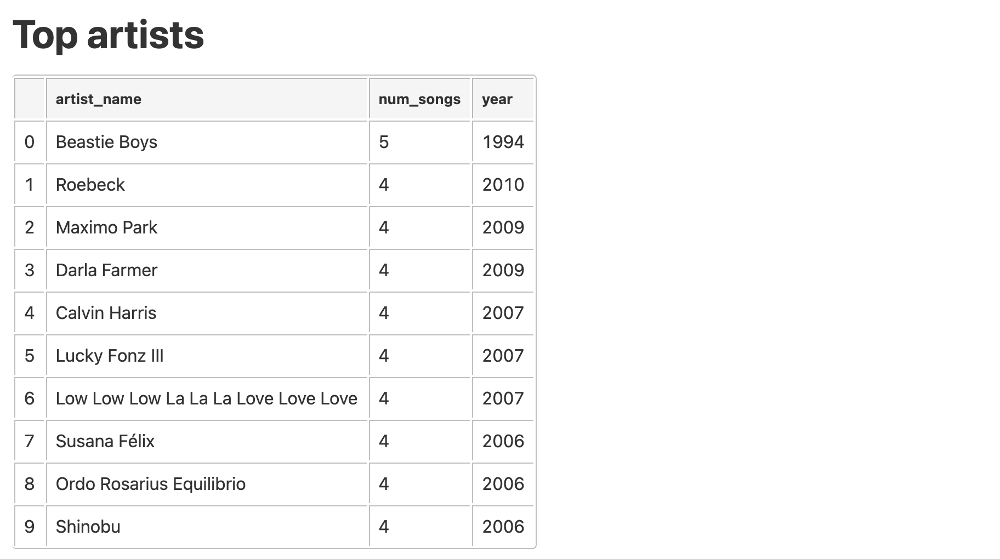
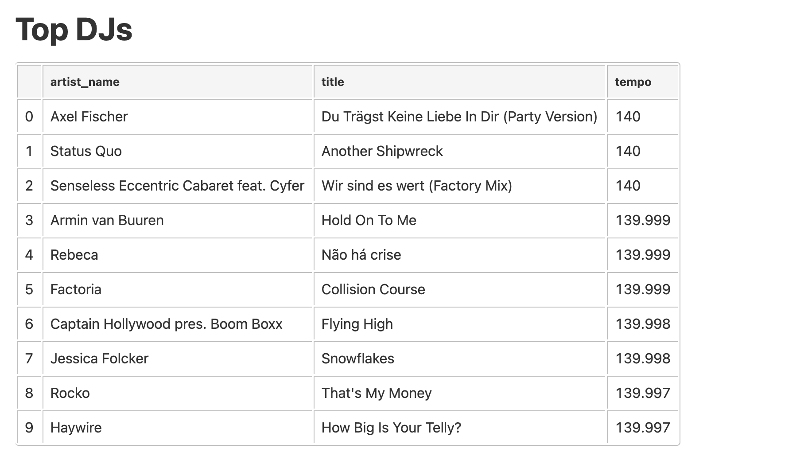

# Data Pipeline with Databricks

This project is about how to create and deploy an end-to-end data processing pipeline, including how to ingest raw data, transform the data, and run analyses on the processed data. The dataset used in this project is a subset of the Million Song Dataset, a collection of features and metadata for contemporary music tracks. This dataset is available in the sample datasets included in the Databricks workspace(DBFS).

## Step 1: Create a cluster

In the compute module, I created the `IDS706 cluster` in my Azure Databricks workspace by using the Azure Databricks portal.



## Step 2: Create ETL Notebook in Databricks

To perform an extract, transform, and load (ETL) workflow, I created 3 scripts,

- Create  `Extract.py` to ingest raw source data and write the raw data to a target table.
``` python
from pyspark.sql.types import DoubleType, IntegerType, StringType, StructType, StructField

# Define variables used in the code below
file_path = "/databricks-datasets/songs/data-001/"
table_name = "raw_song_data" # Replace "your_table_name" with the desired table name
checkpoint_path = "/tmp/pipeline_get_started/_checkpoint/songss_data"

schema = StructType(
  [
    StructField("artist_id", StringType(), True),
    StructField("artist_lat", DoubleType(), True),
    StructField("artist_long", DoubleType(), True),
    StructField("artist_location", StringType(), True),
    StructField("artist_name", StringType(), True),
    StructField("duration", DoubleType(), True),
    StructField("end_of_fade_in", DoubleType(), True),
    StructField("key", IntegerType(), True),
    StructField("key_confidence", DoubleType(), True),
    StructField("loudness", DoubleType(), True),
    StructField("release", StringType(), True),
    StructField("song_hotnes", DoubleType(), True),
    StructField("song_id", StringType(), True),
    StructField("start_of_fade_out", DoubleType(), True),
    StructField("tempo", DoubleType(), True),
    StructField("time_signature", DoubleType(), True),
    StructField("time_signature_confidence", DoubleType(), True),
    StructField("title", StringType(), True),
    StructField("year", IntegerType(), True),
    StructField("partial_sequence", IntegerType(), True)
  ]
)

(spark.readStream
  .format("cloudFiles")
  .schema(schema)
  .option("cloudFiles.format", "csv")
  .option("sep","\t")
  .load(file_path)
  .writeStream
  .option("checkpointLocation", checkpoint_path)
  .trigger(availableNow=True)
  .toTable(table_name)
)
```
- Create  `Transform_load.py` to transform the raw source data and write the transformed data to a Delta table. 
```sql
%sql
CREATE OR REPLACE TABLE Prepare_songs_data
USING DELTA
AS
SELECT
  artist_id,
  artist_name,
  duration,
  release,
  tempo,
  time_signature,
  title,
  year,
  current_timestamp() AS processed_time
FROM
  raw_song_data;

INSERT INTO
  Prepare_songs_data
SELECT
  artist_id,
  artist_name,
  duration,
  release,
  tempo,
  time_signature,
  title,
  year,
  current_timestamp()
FROM
  raw_song_data
```

- Create `query.py` to query the transformed data and do data visualization. Here I also perform proper data validation checks and utilized Sparl SQL for data transformation, ensuring correctness and efficiency. 

I created visualization and tables of the transformed data to communicate results effectively.


```python
# Databricks notebook source
# MAGIC %pip install tabulate
# MAGIC dbutils.library.restartPython()

# COMMAND ----------

# Usage of Spark SQL for data transformations
Num_songs_year = spark.sql("""
    SELECT
    year,
    count(artist_name) AS num_songs
    FROM
    prepare_songs_data
    WHERE
    year > 0
    GROUP BY
    year
    ORDER BY
    year DESC
""").toPandas()

Num_songs_year

# COMMAND ----------

# Proper error handling
row = Num_songs_year.count()[1]
if row>0:
    print(f"Data validation passed. {row} rows available.")
else:
    print("No data queried")

# COMMAND ----------

# Visualization of the transformed data
# Plot a bar plot
plt.figure(figsize=(15, 8))
plt.bar(Num_songs_year["year"], Num_songs_year["num_songs"], color='skyblue')
plt.title("Number of songs for Each Year")
plt.xlabel("Year")
plt.ylabel("Number of songs")
plt.show()
# Save the figure
plot_path = "/dbfs/FileStore/IDS706_Data_Pipeline/num_songs_per_year.png"
plt.savefig(plot_path)
plt.close()


# COMMAND ----------

# Spark SQL Query: Which artists released the most songs each year?
top_artists = spark.sql(
    """
    SELECT
    artist_name,
    count(artist_name)
    AS
    num_songs,
    year
    FROM
    prepare_songs_data
    WHERE
    year > 0
    GROUP BY
    artist_name,
    year
    ORDER BY
    num_songs DESC,
    year DESC
    LIMIT 10
"""
)

# COMMAND ----------

# Spark SQL Query: Find songs for your DJ list
top_DJ = spark.sql(
    """
    SELECT
    artist_name,
    title,
    tempo
    FROM
    prepare_songs_data
    WHERE
    time_signature = 4
    AND
    tempo between 100 and 140
    ORDER BY tempo DESC
    LIMIT 10
"""
)

# COMMAND ----------


from tabulate import tabulate

# Convert top_artists DataFrame to Pandas DataFrame
top_artists_pandas = top_artists.toPandas()

# Convert top_DJ DataFrame to Pandas DataFrame
top_DJ_pandas = top_DJ.toPandas()

# Convert Pandas DataFrame to Markdown format
top_artists_md = tabulate(top_artists_pandas, tablefmt="pipe", headers="keys")
top_DJ_md = tabulate(top_DJ_pandas, tablefmt="pipe", headers="keys")
Num_songs_year_md = tabulate(Num_songs_year, tablefmt="pipe", headers="keys")
# Write to result.md
with open("result.md", "w") as f:
    f.write("# Number of songs for Each Year\n")
    f.write(Num_songs_year_md)
    f.write("\n\n# Top artists\n")
    f.write(top_artists_md)  
    f.write("\n\n# Top DJs\n")
    f.write(top_DJ_md)
print(f"Summary report saved to result.md")
```
These 3 python scripts are stored in `notebook`


## Step 3: Build a Databricks job to run the pipeline


To automate the data pipeline with a Databricks job , I created this `Songs_workflow_2`


It runs successfully


## Step 4: Automate triggering the job

I modified the Makefile,
```Makefile
job:
	python trigger.py

```

I also created a `trigger.py` to implement an automated trigger to initiate the ETL pipeline using GitHub Actions commit&push. The host name, access token and job id are saved in secrets in github.

```python
# When commit&push, trigger the jobs automatically
import requests
import os
from dotenv import load_dotenv

# Load environment variables from .env
load_dotenv()

# Replace with your environment variables or provide the actual values
server_hostname = os.getenv("DATABRICKS_HOST")
job_id = os.getenv("JOB_ID")
access_token = os.getenv("DATABRICKS_TOKEN")
url = f'https://{server_hostname}/api/2.0/jobs/run-now'

headers = {
    'Authorization': f'Bearer {access_token}',
    'Content-Type': 'application/json',
}

data = {
    'job_id': job_id
}

response = requests.post(url, headers=headers, json=data)

if response.status_code == 200:
    print('Job run successfully triggered')
else:
    print(f'Error: {response.status_code}, {response.text}')
```


## Results

[](https://github.com/nogibjj/IDS706-python-Individual-Project-3-XS110/actions/workflows/cicd.yml)

### Video

[Youtube]()

### Data visualization and summary
Here is the results of the Songs_workflow_2, it is saved in [result.md](https://github.com/nogibjj/IDS706-Databricks-Pipeline-XS110/blob/main/result.md).

Data Visualization- Number of songs in each year


Which artists released the most songs each year


The DJs with highest tempo

